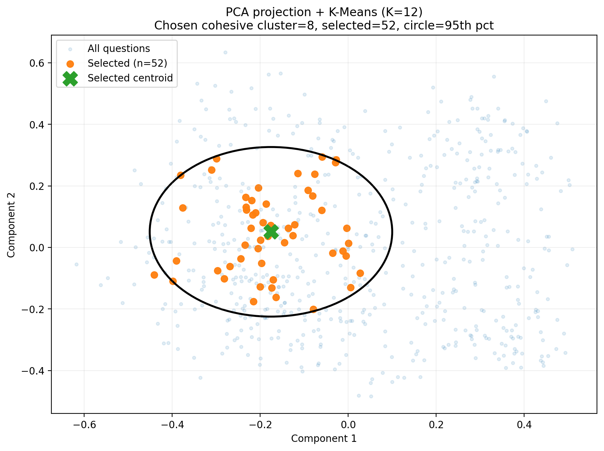
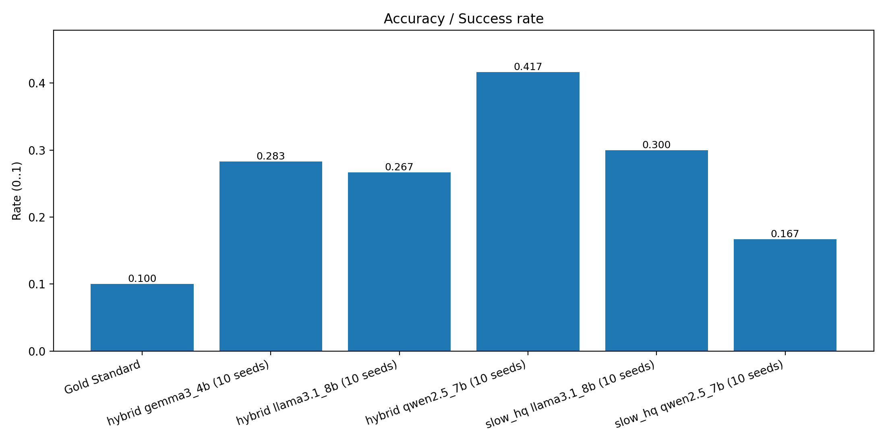

# Extracting Useful Question–Answer Pairs from Examination Regulations
### Bachelor Thesis Project – NLP & LLM Applications

---

## 🎓 Thesis Context

This project was developed as a **Bachelor Thesis** focused on **Natural Language Processing (NLP)** and **LLM applications**. It demonstrates how automated pipelines can transform dense academic regulations into user-friendly knowledge bases.

**Author:** Mohamed Taher Boujnah

---

This project implements an automated pipeline to transform lengthy, complex university examination regulations into structured, searchable Question–Answer (QA) pairs. The system is designed to help students navigate academic policies through a retrieval-based chatbot interface.

---

## 🚀 Project Overview
University examination regulations contain critical information about exams, grading, and retakes, but are often difficult to navigate. This project provides a complete NLP pipeline to:
* **Process** regulation documents and extract structured segments.
* **Generate** candidate QA pairs using local Large Language Models (LLMs) like Gemma, Llama, and Qwen.
* **Filter and evaluate** outputs against a manually curated "gold" dataset.
* **Deploy** a predefined retrieval based chatbot

---

## 🏗 Pipeline Architecture
The system follows a modular multi-stage pipeline:
1. **Preprocessing:** Normalizes formatting and converts documents into structured Markdown.
2. **Chunking:** Splits regulations into meaningful sections while preserving metadata like section names and page numbers.
3. **QA Generation:** Uses local LLMs with strategies like `Hybrid` and `Slow/HQ` to create FAQ pairs.
4. **Retrieval:** Embeds FAQ questions and uses cosine similarity to match user queries.
5. **Interface:** An interactive assistant that retrieves answers based on semantic similarity.

---

## 📊 Evaluation & Results
The project evaluates several models to find the best balance between accuracy and generation speed.

### Model Performance Summary (10 Seeds)
Based on experimental data, **Qwen 2.5 (7B)** using the **Hybrid** strategy achieved the highest success rate.

| Model & Strategy | Accuracy Success Rate | Coverage | Hallucination Rate | Runtime (sec) |
| :--- | :---: | :---: | :---: | :---: |
| **Qwen 2.5 7B (Hybrid)** | **41.67%** | **31.36%** | 58.51% | 396.67 |
| Llama 3.1 8B (Slow HQ) | 30.00% | 26.27% | 63.64% | 366.72 |
| Gemma 3 4B (Hybrid) | 28.33% | 27.12% | 75.21% | 380.85 |

> *Source: data/plots/10seeds/summary_table.json*

### Visualizations
Below are the key visualizations generated during the research phase:

**Clustering of QA Pairs**


**Model Accuracy Comparison**


---

## 📁 Repository Structure
```text
.
├── backend/            # Core logic (API, Indexer, Generation)
│   ├── qa/             # Hybrid and Slow/HQ generation scripts
│   ├── evaluation/     # Metrics and evaluation scripts
│   └── retrieval/      # Embedding-based retrieval logic
├── hainrich-master/    # Chatbot interface 
├── data/               
│   ├── gold/           # Human-curated reference dataset
│   ├── final/          # Final selected FAQ pairs
│   ├── generated/      # Raw LLM outputs
│   └── plots/          # Performance and cluster visualizations
└── requirements.txt    # Project dependencies


